# Privacy-Preserving CDSS — Deep Project Analysis

> A **Hybrid Retrieval-Augmented Generation (RAG)** Clinical Decision Support System for genomic variant interpretation, using a **LangGraph** state-machine orchestrator, **PostgreSQL + pgvector** dual-store, and a local **Ollama** LLM.

---

## 1. Repository Map

```
Privacy-Preserving-CDSS/
├── app/
│   ├── main.py                          # FastAPI entrypoint (uvicorn, port 5656)
│   ├── config.py                        # Pydantic BaseSettings (.env loader)
│   ├── api/
│   │   ├── router.py                    # POST /query → invokes LangGraph
│   │   └── schemas.py                   # QueryRequest, QueryResponse, Citation
│   ├── db/
│   │   ├── postgres/
│   │   │   ├── clinvar_schema.sql       # DDL: variants + medical_documents tables
│   │   │   └── clinvar_ingestion.py     # Downloads & ingests ClinVar variants
│   │   └── vector/
│   │       └── indexing.py              # PDF/TXT → chunks → embeddings → pgvector
│   ├── models/
│   │   └── embeddings.py                # SentenceTransformer wrapper (768-dim)
│   └── pipeline/
│       ├── decomposition.py             # Keyword-based query → SubQuery routing
│       ├── construction/                # (empty — reserved for self_query / text2sql)
│       ├── graph/
│       │   ├── state.py                 # CDSSGraphState TypedDict
│       │   ├── nodes.py                 # 7 node functions (decompose→cite)
│       │   └── workflow.py              # LangGraph DAG wiring
│       ├── retrieval/
│       │   ├── multi_query.py           # LLM query expansion + vector search
│       │   ├── reranker.py              # BGE cross-encoder re-ranking
│       │   └── crag_evaluator.py        # Corrective RAG: score-based grading
│       ├── generation/
│       │   ├── guardrails.py            # System prompt + context builder
│       │   ├── self_rag.py              # JSON-schema-constrained generation
│       │   └── citation_enforcer.py     # Hallucination fix + citation extraction
│       └── sources/
│           ├── postgres_client.py       # ClinVar SQL lookups (rsid / gene)
│           ├── vector_client.py         # pgvector cosine similarity search
│           ├── gnomad_client.py         # gnomAD GraphQL API (allele frequency)
│           └── clingen_client.py        # ClinGen REST API (gene validity)
├── frontend/
│   ├── templates/index.html             # (empty — placeholder)
│   └── static/{css/style.css, js/main.js}
├── docs/
│   ├── manifest.json                    # Parser routing per document
│   ├── protocols/                       # NCCN Breast.pdf
│   └── screening/                       # NCCN Genetic-Familial.pdf
├── tests/
│   ├── test_routing.py
│   ├── test_retrieval.py
│   ├── test_generation.py
│   └── test_clingen_client.py
├── docker-compose.yml                   # pgvector + pgAdmin
└── requirements.txt
```

---

## 2. High-Level Architecture

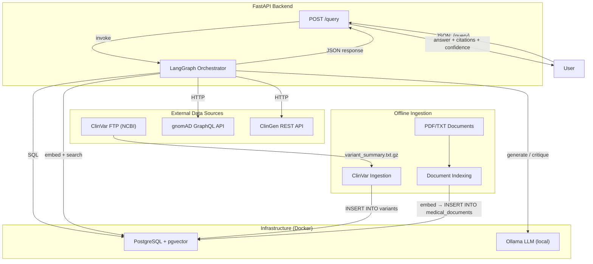

---

## 3. LangGraph Workflow — The Core Pipeline

The entire query lifecycle is a 7-node **Directed Acyclic Graph** defined in [workflow.py](file:///c:/Users/Master/Documents/GitHub/Privacy-Preserving-CDSS/app/pipeline/graph/workflow.py). Two parallel retrieval branches merge at the Evaluator.

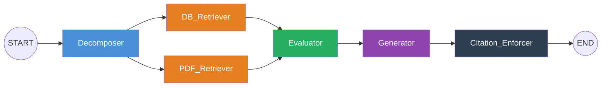

### Node-by-Node Data Flow

| # | Node | File | Reads from State | Writes to State | Key Operations |
|---|------|------|-----------------|----------------|----------------|
| 1 | **Decomposer** | [nodes.py:16](file:///c:/Users/Master/Documents/GitHub/Privacy-Preserving-CDSS/app/pipeline/graph/nodes.py#L16-L22) | [query](file:///c:/Users/Master/Documents/GitHub/Privacy-Preserving-CDSS/app/api/router.py#13-32) | [gene](file:///c:/Users/Master/Documents/GitHub/Privacy-Preserving-CDSS/app/pipeline/graph/nodes.py#128-135), `sub_queries` | Extract gene symbol; keyword-match → [SubQuery](file:///c:/Users/Master/Documents/GitHub/Privacy-Preserving-CDSS/app/pipeline/decomposition.py#4-9) list |
| 2 | **DB_Retriever** | [nodes.py:24](file:///c:/Users/Master/Documents/GitHub/Privacy-Preserving-CDSS/app/pipeline/graph/nodes.py#L24-L58) | `sub_queries`, [gene](file:///c:/Users/Master/Documents/GitHub/Privacy-Preserving-CDSS/app/pipeline/graph/nodes.py#128-135) | `trusted_chunks` | ClinVar SQL, gnomAD API, ClinGen API |
| 3 | **PDF_Retriever** | [nodes.py:61](file:///c:/Users/Master/Documents/GitHub/Privacy-Preserving-CDSS/app/pipeline/graph/nodes.py#L61-L79) | `sub_queries` | `candidate_chunks` | Multi-query expansion → pgvector search per category |
| 4 | **Evaluator** | [nodes.py:82](file:///c:/Users/Master/Documents/GitHub/Privacy-Preserving-CDSS/app/pipeline/graph/nodes.py#L82-L126) | `candidate_chunks`, `trusted_chunks`, [query](file:///c:/Users/Master/Documents/GitHub/Privacy-Preserving-CDSS/app/api/router.py#13-32), [gene](file:///c:/Users/Master/Documents/GitHub/Privacy-Preserving-CDSS/app/pipeline/graph/nodes.py#128-135) | `verified_chunks` | Deduplicate → rerank → CRAG grade → gene-filter NCCN → merge |
| 5 | **Generator** | [nodes.py:128](file:///c:/Users/Master/Documents/GitHub/Privacy-Preserving-CDSS/app/pipeline/graph/nodes.py#L128-L134) | [query](file:///c:/Users/Master/Documents/GitHub/Privacy-Preserving-CDSS/app/api/router.py#13-32), `verified_chunks` | `draft_answer` | JSON-schema-constrained Ollama call → structured clinical response |
| 6 | **Citation_Enforcer** | [nodes.py:140](file:///c:/Users/Master/Documents/GitHub/Privacy-Preserving-CDSS/app/pipeline/graph/nodes.py#L140-L176) | `draft_answer`, `verified_chunks`, `trusted_chunks`, `candidate_chunks` | `final_answer`, [citations](file:///c:/Users/Master/Documents/GitHub/Privacy-Preserving-CDSS/app/pipeline/generation/citation_enforcer.py#83-100), `confidence` | Fix hallucinated citations, extract citation list, compute confidence |

---

## 4. State Schema

Defined in [state.py](file:///c:/Users/Master/Documents/GitHub/Privacy-Preserving-CDSS/app/pipeline/graph/state.py) as a `TypedDict`:

```python
class CDSSGraphState(TypedDict):
    query: str                              # original user question
    gene: Optional[str]                     # extracted gene symbol (e.g. "BRCA1")
    sub_queries: list                       # list[SubQuery] from decomposition

    trusted_chunks: list[RetrievedChunk]    # DB_Retriever output (ClinVar/gnomAD/ClinGen)
    candidate_chunks: list[RetrievedChunk]  # PDF_Retriever output (vector search)

    verified_chunks: list[RetrievedChunk]   # Evaluator output (merged + filtered)
    draft_answer: str                       # Generator output

    final_answer: str                       # Citation_Enforcer output
    citations: list[Citation]               # extracted inline citations
    confidence: str                         # "high" | "medium" | "low"
```

---

## 5. Query Decomposition Flow

[decomposition.py](file:///c:/Users/Master/Documents/GitHub/Privacy-Preserving-CDSS/app/pipeline/decomposition.py) routes the query by keyword matching into sub-queries:

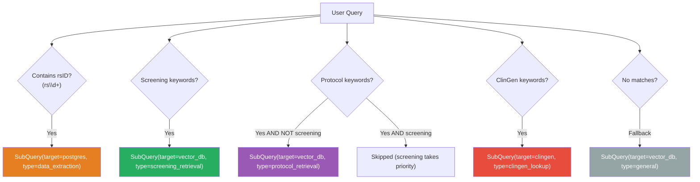

### Keyword Groups

| Category | Target | Keywords (sample) |
|----------|--------|-------------------|
| Variant IDs | [postgres](file:///c:/Users/Master/Documents/GitHub/Privacy-Preserving-CDSS/app/pipeline/retrieval/reranker.py#45-59) | `rs\d+`, `NM_\d+`, `NP_\d+` |
| Protocol | `vector_db` (protocol) | `chemotherapy`, `radiotherapy`, `neoadjuvant`, `treatment regimen` |
| Screening | `vector_db` (screening_protocol) | `nccn`, `screening`, `surveillance`, `rrso`, `hereditary` |
| ClinGen | [clingen](file:///c:/Users/Master/Documents/GitHub/Privacy-Preserving-CDSS/app/pipeline/retrieval/reranker.py#85-123) API | [clingen](file:///c:/Users/Master/Documents/GitHub/Privacy-Preserving-CDSS/app/pipeline/retrieval/reranker.py#85-123), `gene validity`, `expert panel` |

---

## 6. DB_Retriever — Structured Data Path

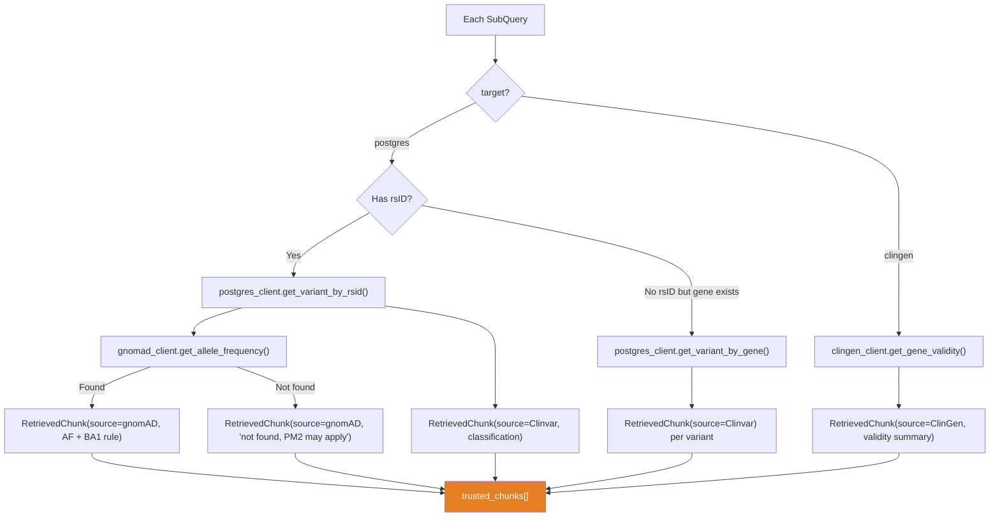

### Data Sources Deep Dive

| Source | Module | Type | Details |
|--------|--------|------|---------|
| **ClinVar** | [postgres_client.py](file:///c:/Users/Master/Documents/GitHub/Privacy-Preserving-CDSS/app/pipeline/sources/postgres_client.py) | Local SQL | `SELECT FROM variants WHERE rsid = %s` or `WHERE gene_symbol = %s` |
| **gnomAD** | [gnomad_client.py](file:///c:/Users/Master/Documents/GitHub/Privacy-Preserving-CDSS/app/pipeline/sources/gnomad_client.py) | External GraphQL | Resolves rsID → chr-pos-ref-alt via local DB, then queries `gnomad_r4`. Returns AF + BA1 applicability |
| **ClinGen** | [clingen_client.py](file:///c:/Users/Master/Documents/GitHub/Privacy-Preserving-CDSS/app/pipeline/sources/clingen_client.py) | External REST | `GET /api/genes?search=BRCA1` → gene-disease validity, actionability, dosage, variant curation status |

---

## 7. PDF_Retriever — Unstructured Data Path

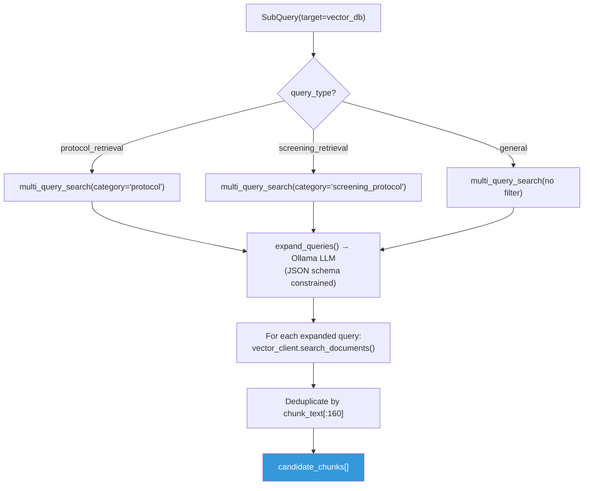

### Multi-Query Expansion Detail

1. **Prompt selection** — different system prompts for `screening_retrieval`, `protocol_retrieval`, and `general` ([multi_query.py:58-103](file:///c:/Users/Master/Documents/GitHub/Privacy-Preserving-CDSS/app/pipeline/retrieval/multi_query.py#L58-L103))
2. **JSON-schema constrained generation** — `ollama.chat(format=ExpandedQueries.model_json_schema())` forces the LLM to output `{"queries": [...]}` with no preamble
3. **Preamble stripping** — a safety net [_clean_variants()](file:///c:/Users/Master/Documents/GitHub/Privacy-Preserving-CDSS/app/pipeline/retrieval/multi_query.py#38-56) strips numbered lines, bullet prefixes
4. **Search** — `original_query` + `n` variants each search pgvector with cosine similarity, filtered by `category`
5. **Deduplication** — by first 160 chars of `chunk_text`

---

## 8. Evaluator — Merging & Filtering

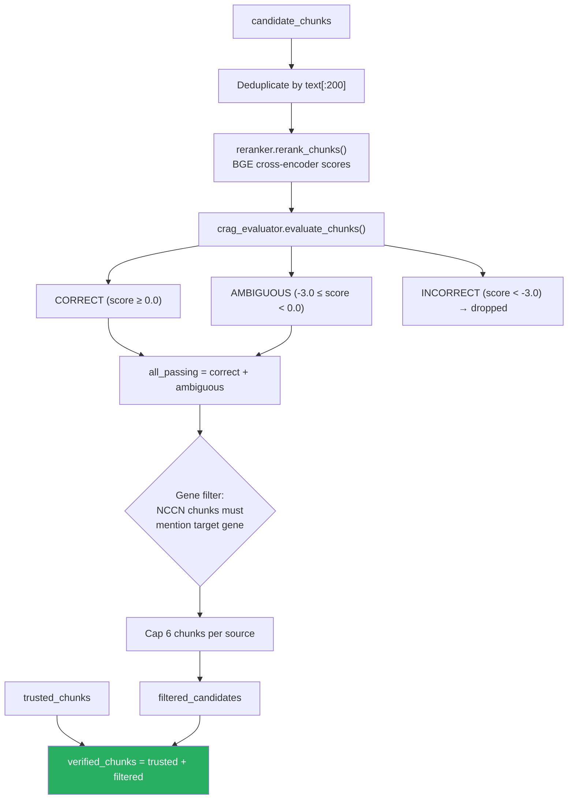

---

## 9. Generation — Self-RAG with JSON Schema

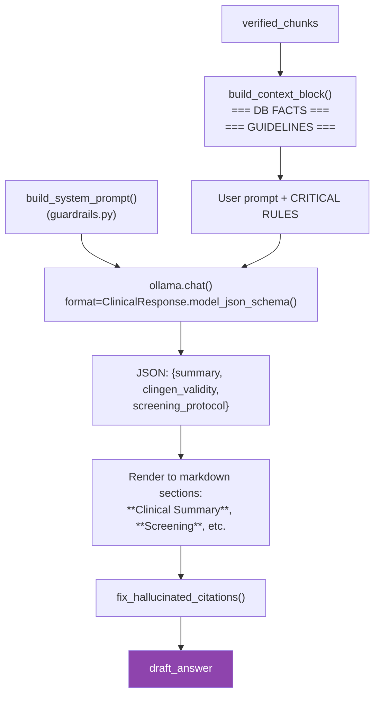

### ClinicalResponse Schema (Pydantic)

```python
class ClinicalResponse(BaseModel):
    summary: ClinicalClaim             # variant classification + population freq
    clingen_validity: list[ClinicalClaim]  # gene-disease validity from ClinGen
    screening_protocol: list[ClinicalClaim]  # NCCN screening/surveillance
```

Each [ClinicalClaim](file:///c:/Users/Master/Documents/GitHub/Privacy-Preserving-CDSS/app/pipeline/generation/self_rag.py#11-14) = `{text: str, citations: list[str]}`, where citations are `[Source: X, Reference: Y]` format.

---

---

## 10. Citation Enforcer & Confidence Scoring

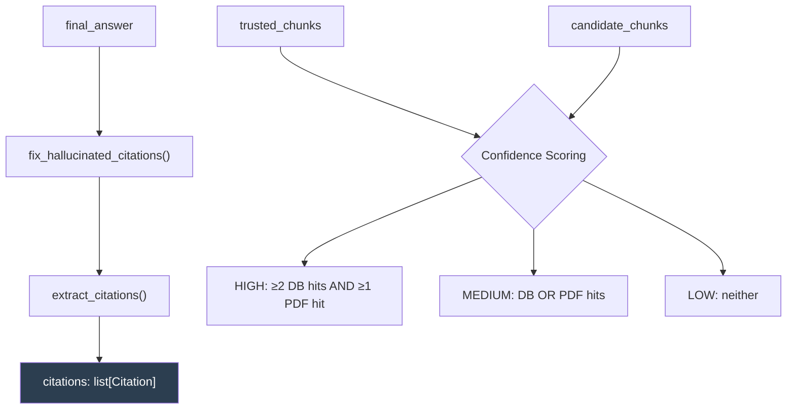

### Citation Fix Logic ([citation_enforcer.py](file:///c:/Users/Master/Documents/GitHub/Privacy-Preserving-CDSS/app/pipeline/generation/citation_enforcer.py))

1. Parse all `[Source: X, Reference: Y]` in the answer text
2. If cited source **exists** in retrieved chunks → trust source, only fix reference
3. If cited source is **unknown** → score surrounding text against keyword dictionaries (`Clinvar`, `ClinGen`, `gnomAD`, `NCCN`) → remap to correct source (requires ≥2 keyword hits)

---

## 12. Offline Ingestion Pipelines

### 12a. ClinVar Ingestion

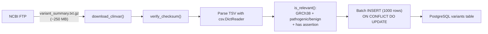

### 12b. Document Indexing

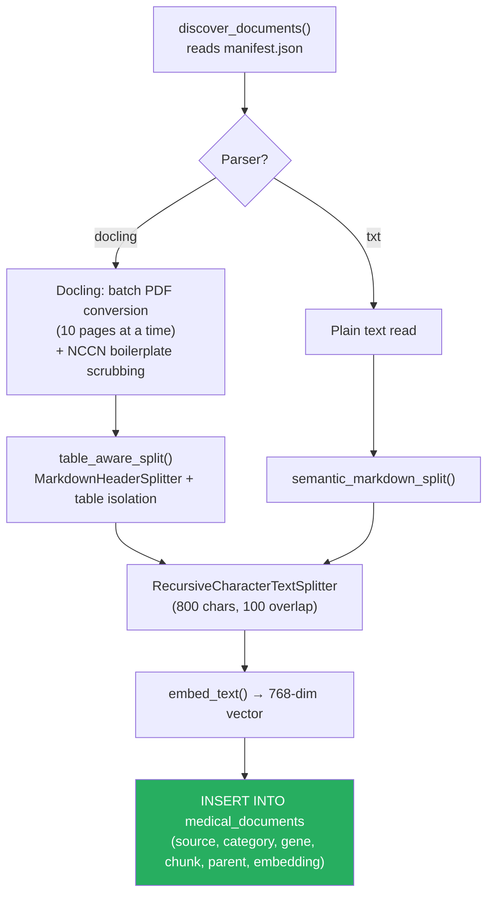

### Document Categories

| Subfolder | Category DB Value | Parser | Documents |
|-----------|------------------|--------|-----------|
| `docs/_archive/` | *(removed)* | *(archived)* | ACMG 2015 v3 (no longer indexed) |
| `docs/protocols/` | `protocol` | docling | NCCN Breast v2 2026 |
| `docs/screening/` | `screening_protocol` | docling | NCCN Genetic/Familial High-Risk |

---

## 13. Database Schema

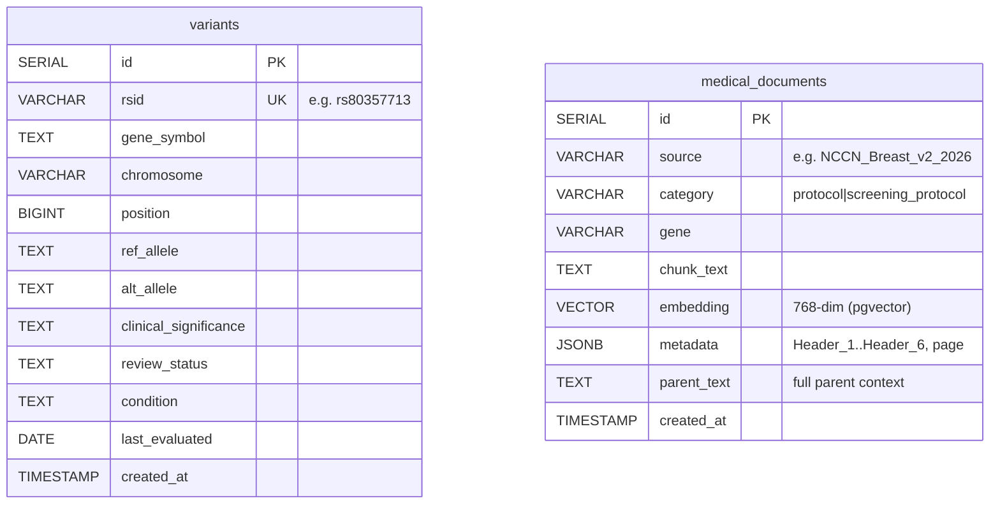

---

## 14. End-to-End Data Flow Trace

Here is a complete trace for an example query: **"What is the clinical significance of rs80357713 in BRCA1 and what are the NCCN screening recommendations?"**

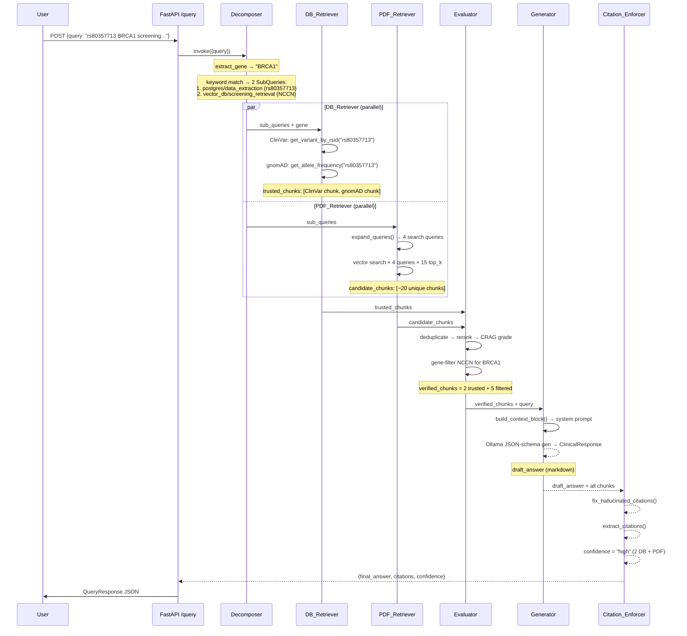

---

## 15. Technology Stack Summary

| Layer | Technology | Purpose |
|-------|-----------|---------|
| **API** | FastAPI + Uvicorn | HTTP interface, Pydantic validation |
| **Orchestration** | LangGraph (StateGraph) | DAG-based pipeline with parallel branches |
| **LLM** | Ollama (local, configurable model) | Query expansion, generation, critic |
| **Embeddings** | SentenceTransformer (768-dim) | Document & query embedding |
| **Reranking** | `BAAI/bge-reranker-large` (CrossEncoder) | Precision re-ranking of candidate chunks |
| **Database** | PostgreSQL 17 + pgvector | Dual-store: structured SQL + vector similarity |
| **PDF Parsing** | Docling (table-aware) | Layout-aware PDF → Markdown conversion |
| **Chunking** | LangChain `MarkdownHeaderTextSplitter` + `RecursiveCharacterTextSplitter` | Hierarchical → child chunk splitting |
| **External APIs** | gnomAD GraphQL, ClinGen REST | Population frequency, gene validity |
| **Config** | pydantic-settings + `.env` | Environment-based configuration |
| **Container** | Docker Compose | pgvector + pgAdmin orchestration |

---

## 16. Key Design Patterns

1. **Hybrid RAG** — structured DB facts ("trusted") + unstructured PDF chunks ("candidates") merged at evaluation
2. **Corrective RAG (CRAG)** — cross-encoder scoring with three grades (correct/ambiguous/incorrect) to filter low-quality chunks
3. **Self-RAG** — JSON-schema-constrained generation ensures structured output
4. **Multi-Query Expansion** — dedicated prompt templates per document category (screening/protocol) to improve retrieval recall
5. **Citation Enforcement** — post-hoc hallucination detection using keyword dictionaries + source existence checks
6. **Parallel Retrieval** — LangGraph fan-out: DB_Retriever and PDF_Retriever execute concurrently, merge at Evaluator
7. **Privacy-Preserving** — all LLM inference runs locally via Ollama; no patient data leaves the system

---

## 17. Unused / Placeholder Modules

| File | Status |
|------|--------|
| `pipeline/construction/self_query.py` | Empty — reserved for self-querying retrieval |
| `pipeline/construction/text_to_sql.py` | Empty — reserved for natural language → SQL |
| `frontend/templates/index.html` | Empty — no frontend implementation yet |
