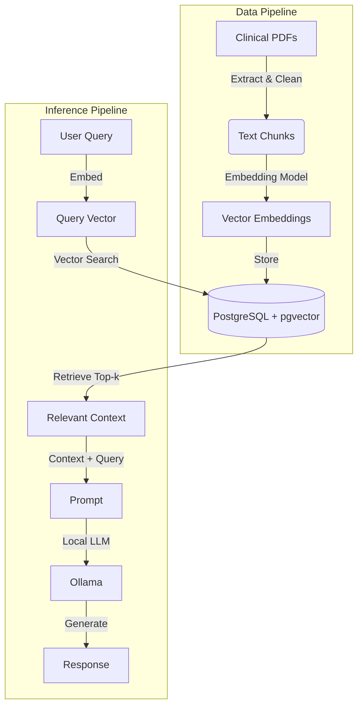

# Privacy-Preserving Clinical Decision Support System (CDSS)

[](https://www.python.org/downloads/)
[](https://www.docker.com/)
[](https://www.postgresql.org/)
[](https://ollama.com/)

A fully local, privacy-preserving Clinical Decision Support System (CDSS) utilizing **Retrieval-Augmented Generation (RAG)**. This project demonstrates how to build a compliant healthcare AI assistant that keeps patient data offline while leveraging the power of Large Language Models (LLMs) and vector databases.

---

## 🚀 Key Features

*   **🔒 Privacy-First**: Zero external data transmission. All inference runs locally on your hardware.
*   **🧠 RAG Architecture**: Grounds LLM responses in your own verified clinical guidelines (PDFs) to minimize hallucinations.
*   **⚡ High Performance**: Uses `pgvector` for efficient similarity search and `sentence-transformers` for semantic embeddings.
*   **🤖 Local Inference**: seamless integration with **Ollama** to run models like Llama-3, BioMistral, or Nemotron.
*   **🔌 Modular Design**: clearly separated modules for ingestion, retrieval, generation, and API handling.

## 🏗️ Architecture

The system follows a standard RAG pipeline:



## 🛠️ Technology Stack

| Component | Technology | Description |
|-----------|------------|-------------|
| **LLM Server** | [Ollama](https://ollama.com/) | Hosts local models (Llama-3, BioMistral) |
| **Vector DB** | [pgvector](https://github.com/pgvector/pgvector) | PostgreSQL extension for vector similarity search |
| **Embeddings** | [Sentence-Transformers](https://sbert.net/) | `BAAI/bge-large-en-v1.5` (default) |
| **Orchestration** | Python 3 | Custom RAG pipeline implementation |
| **Frontend** | [Streamlit](https://streamlit.io/) | Interactive chat interface for clinicians |
| **Containerization** | Docker | Database and admin tools |

## 🏁 Quick Start

### Prerequisites

*   **Docker & Docker Compose**: For running the database.
*   **NVIDIA GPU (Recommended)**: For faster embedding and LLM inference.
*   **Ollama**: Installed locally to serve the LLM.
    *   [Download Ollama](https://ollama.com/download)
    *   Run: `ollama pull llama3` (or your preferred model)

### Installation

1.  **Clone the repository:**
    ```bash
    git clone https://github.com/RenX86/Privacy-Preserving-CDSS.git
    cd Privacy-Preserving-CDSS
    ```

2.  **Set up the environment:**
    ```bash
    cp .env.example .env
    # Edit .env if needed (default settings usually work for local dev)
    ```

3.  **Install Python dependencies:**
    ```bash
    python -m venv .venv
    # Windows
    .venv\Scripts\activate
    # Linux/Mac
    source .venv/bin/activate
    
    pip install -r requirements.txt
    ```

4.  **Start the Database:**
    ```bash
    cd docker/postgres
    docker-compose up -d
    cd ../..
    ```

### Usage

#### 1. Ingest Documents
Place your clinical guideline PDFs in the `data/raw` folder. Then run the ingestion script:

```bash
python scripts/ingest_documents.py
```
This will parse the PDFs, generate embeddings, and store them in your local PostgreSQL database.

#### 2. Run the CDSS Application
Start the Streamlit interface:

```bash
streamlit run app/streamlit_app.py
```
Open your browser to `http://localhost:8501` to start chatting with your documents.

#### 3. CLI Testing
You can also test the retrieval pipeline directly from the command line:

```bash
python src/rag/pipeline.py
```

## 📂 Project Structure

```
├── app/                 # Streamlit frontend application
├── data/                # Data storage (raw PDFs and processed chunks)
├── docker/              # Docker configurations (PostgreSQL)
├── scripts/             # Utility scripts (ingestion, testing)
├── src/                 # Core source code
│   ├── api/             # Ollama client and prompts
│   ├── config/          # Configuration settings
│   ├── database/        # Database operations
│   ├── embedding/       # Embedding model handling
│   └── rag/             # Main RAG pipeline (retrieval & generation)
└── requirements.txt     # Python dependencies
```


---

*Note: This project is part of a research dissertation on Privacy-Preserving AI in Healthcare.*
